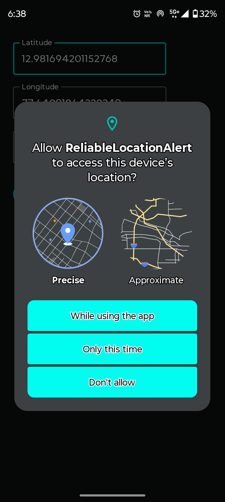
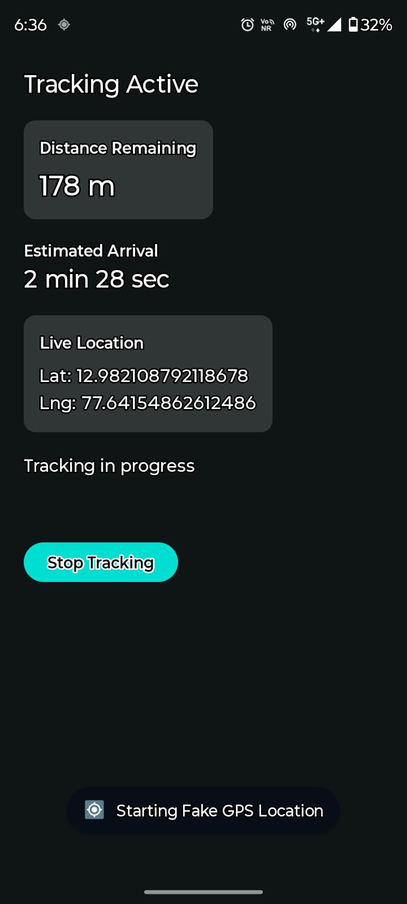
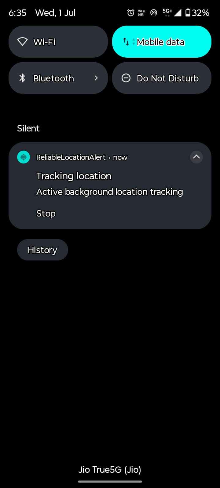
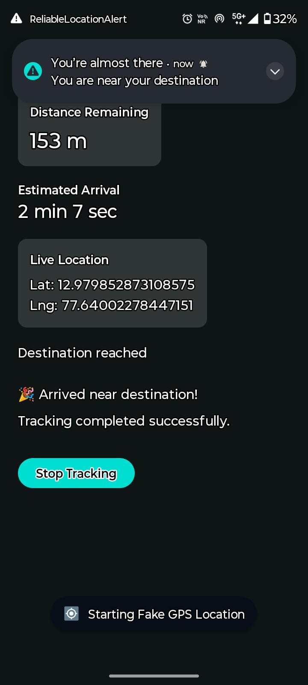

# Reliable Location Alert

An Android application that solves a deceptively hard problem: **alerting a user when they are near a destination, reliably, even when the OS is aggressively managing battery and process lifetime.**

> This project focuses on correctness, reliability, and engineering trade-offs rather than UI polish.

---

## Screenshots

<table>
  <tr>
    <td align="center">
      <br/>
      <sub><b>Permission Flow</b></sub><br/>
      <sub>Sequential permission chain including background location</sub>
    </td>
    <td align="center">
      <br/>
      <sub><b>Active Tracking</b></sub><br/>
      <sub>Live distance, ETA, and degraded state indicator</sub>
    </td>
    <td align="center">
      <br/>
      <sub><b>Foreground Service</b></sub><br/>
      <sub>Persistent notification while tracking is active</sub>
    </td>
    <td align="center">
      <br/>
      <sub><b>Arrival Alert</b></sub><br/>
      <sub>Exact alarm fires even when device is in Doze mode</sub>
    </td>
  </tr>
</table>

---

## The Problem

Most location-based alert apps break in one or more of these ways:

- The foreground service is killed and never restarted after a device reboot
- GPS signal degrades underground or in tunnels, and the app either false-triggers or goes silent
- The alert fires late — or not at all — because the OS deferred the alarm
- The app drains battery by polling at high frequency even when the user is far from the destination

This project addresses all four.

---

## How It Works

### Tracking State Machine

Every active session moves through a well-defined set of states:

```
IDLE → TRACKING_ACTIVE → NEAR_DESTINATION → ALERT_TRIGGERED → COMPLETED
               ↕
       TRACKING_DEGRADED
```

| State | Meaning |
|---|---|
| `IDLE` | No active session |
| `TRACKING_ACTIVE` | Receiving location updates normally |
| `TRACKING_DEGRADED` | GPS accuracy has dropped below threshold (≥ 500 m for 3 consecutive samples) |
| `NEAR_DESTINATION` | Prediction threshold crossed — distance or ETA indicates arrival is imminent |
| `ALERT_TRIGGERED` | Alarm has been scheduled; service is shutting down |
| `COMPLETED` | User acknowledged the alert; session is done |
| `ERROR_RECOVERABLE` | Transient failure — permission revoked, signal lost |

State transitions are enforced inside `ProcessLocationUpdateUseCase` — a pure Kotlin class with zero Android dependencies, making it fully unit-testable without a device or emulator.

### Arrival Detection

Arrival is not triggered by a single location sample. The app maintains a **sliding window buffer of 5 samples** and requires **3 consecutive near-destination evaluations** before transitioning state. This eliminates false triggers from GPS drift or brief signal anomalies.

A sample is considered near-destination if either:
- The **average distance** across high-accuracy samples (accuracy ≤ 50 m) is within the configured alert radius, **or**
- The **estimated ETA** drops below 60 seconds

### ETA Estimation

ETA is derived from speed across buffered samples, averaged and clamped to a realistic range. When no speed data is available (GPS cold start, low-accuracy provider), it falls back to a conservative walking speed — so the user always sees a reasonable estimate rather than a blank field.

### Reliability Under OS Pressure

**GPS Watchdog** — A coroutine running inside the foreground service checks every 30 seconds whether a location update has arrived in the last 90 seconds. If not, the session transitions to `TRACKING_DEGRADED` and the UI reflects this immediately. When updates resume, the session self-heals after 3 good-accuracy samples with no user action required.

**Boot Recovery** — If the device restarts mid-journey, `BootReceiver` reads the persisted session from Room and restarts the foreground service automatically.

**Exact Alarms** — The arrival alert is scheduled via `AlarmManager.setExactAndAllowWhileIdle()`, which fires even in Doze mode. This ensures the alert reaches the user even if the device has been idle since the service exited.

**Battery Optimization** — Before tracking starts, the app checks whether battery optimization is active for the process. If so, the user is prompted to exempt the app — preventing the OS from deferring or killing the foreground service mid-journey.

### Location Updates

Location is provided by the Fused Location Provider on a **background thread**, configured with:

- **Interval:** 30 seconds (balanced power vs. accuracy)
- **Min update interval:** 10 seconds (OS can deliver faster when a high-accuracy fix is already available)

All computation — state machine evaluation, distance calculation, ETA — runs off the main thread, so the UI thread is never blocked by location processing.

---

## Architecture

```
app/
├── core/
│   ├── data/
│   │   ├── local/          # Room database, DAO, entity
│   │   └── repository/     # TrackingRepository interface + impl
│   ├── domain/
│   │   ├── model/          # Pure Kotlin data/state models
│   │   └── usecase/        # ProcessLocationUpdateUseCase, DistanceCalculator, EtaEstimator
│   └── system/
│       ├── alarm/          # AlarmManagerScheduler, AlertReceiver, AlertNotifier
│       ├── boot/           # BootReceiver
│       ├── location/       # LocationProvider interface, FusedLocationProviderImpl
│       ├── permission/     # PermissionManager (multi-step permission chain)
│       ├── service/        # LocationTrackingService (foreground)
│       └── util/           # BatteryOptimizationHelper
├── di/                     # Hilt modules (Database, Repository, System)
└── ui/
    ├── components/         # Shared Compose components
    ├── presentation/       # TrackingViewModel
    └── screens/            # DestinationSetupForm, TrackingScreen
```

Dependency direction is strictly enforced:

```
ui → domain ← data
         ↑
       system
```

- `domain` has zero Android dependencies — pure Kotlin
- `system` implements interfaces defined in `domain` (e.g. `LocationProvider`, `AlertScheduler`)
- `ui` depends only on the repository and ViewModel — it has no knowledge of how location is obtained
- All wiring is handled by Hilt

---

## Key Engineering Decisions

**Why `AlarmManager` instead of a coroutine delay for the alert?**

A coroutine delay lives inside the service process. If the OS kills the process after `NEAR_DESTINATION` is detected but before the user is notified, the alert is silently lost. `AlarmManager.setExactAndAllowWhileIdle()` is OS-managed — it survives process death and fires in Doze mode.

**Why persist session state to Room on every location update?**

If the service is killed mid-journey (OOM, force-stop, reboot), the last known position, distance, ETA, and tracking state must all be recoverable. Without persistence, every restart begins from scratch with no continuity.

**Why a multi-sample buffer instead of reacting to each fix?**

Individual GPS fixes are noisy — especially in dense urban environments, tunnels, or near tall buildings. Averaging across a window of recent samples filtered by reported accuracy produces a far more stable distance estimate. Requiring 3 consecutive near-destination evaluations prevents a single bad fix from firing a false alert.

**Why model `TRACKING_DEGRADED` instead of just stopping?**

Silently stopping when GPS degrades leaves the user with no feedback and risks missing the destination entirely. Degraded state is explicitly modelled, surfaced in the UI, and self-healing — the service continues running and recovers automatically when signal quality improves.

---

## Testing

The domain layer is tested independently of Android:

- `ProcessLocationUpdateUseCaseTest` — covers all state machine transitions including degraded recovery, consecutive counter resets, and the `ALERT_TRIGGERED` terminal state
- `EtaEstimatorTest` — covers speed averaging, fallback to walking speed, and ETA boundary conditions

Tests run on the JVM with no emulator or device required.

---

## Permissions

| Permission | Purpose |
|---|---|
| `ACCESS_FINE_LOCATION` / `ACCESS_COARSE_LOCATION` | Core location tracking |
| `ACCESS_BACKGROUND_LOCATION` | Tracking continues when the app is not in the foreground |
| `FOREGROUND_SERVICE` / `FOREGROUND_SERVICE_LOCATION` | Required to run the tracking service |
| `POST_NOTIFICATIONS` | Foreground service notification + arrival alert (Android 13+) |
| `SCHEDULE_EXACT_ALARM` | Arrival alert must fire on time, even in Doze |
| `RECEIVE_BOOT_COMPLETED` | Resume tracking after device reboot |
| `REQUEST_IGNORE_BATTERY_OPTIMIZATIONS` | Prevent OS from deferring or killing the service |

The full permission flow is managed by `PermissionManager`, which walks through each permission sequentially and handles the Android 10+ edge case where background location requires a redirect to system settings.

---

## Tech Stack

| | |
|---|---|
| Language | Kotlin |
| UI | Jetpack Compose + Material 3 |
| Architecture | MVVM + Clean Architecture |
| DI | Hilt |
| Database | Room |
| Location | Fused Location Provider (Google Play Services) |
| Background | Foreground Service + AlarmManager |
| Min SDK | 26 (Android 8.0) |
| Target SDK | 36 |

---

## Running the Project

1. Clone the repository
2. Open in Android Studio Hedgehog or later
3. Run on a **physical device** — background location and exact alarms behave differently on emulators
4. Grant all requested permissions, including **"Allow all the time"** for location
5. Exempt the app from battery optimization when prompted — this is required for reliable tracking

---

## What's Not In Scope

- Map UI or geocoding — destination is entered as coordinates
- Multiple concurrent tracking sessions
- Server-side tracking or location sharing
- UI polish — the focus of this project is the background reliability layer